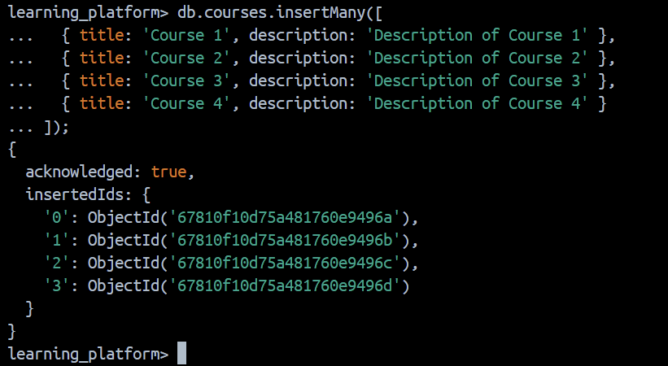

# Projet de Fin de Module NoSQL

Ce projet consiste en la création d'une petite API pour une plateforme d'apprentissage en ligne. Il suit une structure professionnelle, met en œuvre les bonnes pratiques de développement, et utilise des bases de données NoSQL (MongoDB et Redis).

## Structure du Projet

### db.js

#### Pourquoi créer un module séparé pour les connexions aux bases de données ?
- Centralisation et réutilisation de la logique de connexion.
- Amélioration de l'organisation et de la lisibilité.
- Gestion facile des erreurs et des reconnections.
- Possibilité de tester la logique de connexion indépendamment.

#### Comment gérer proprement la fermeture des connexions ?
- Utiliser une fonction dédiée pour fermer chaque connexion dans le bon ordre :
  - Fermer MongoDB avec `mongoClient.close()`.
  - Fermer Redis avec `redisClient.quit()`.
- Inclure cette fonction dans un gestionnaire de signaux système (`process.on`).

### env.js

#### Pourquoi est-il important de valider les variables d'environnement au démarrage ?
- Garantit que toutes les dépendances nécessaires à l'exécution sont définies avant le démarrage.
- Évite des comportements imprévisibles ou des plantages ultérieurs.

#### Que se passe-t-il si une variable requise est manquante ?
- Une erreur explicative est levée au démarrage (via `throw`).
- Cela permet de corriger rapidement la configuration et empêche un démarrage incorrect.

### courseController.js

#### Quelle est la différence entre un contrôleur et une route ?
- Une **route** est une définition d'URL associée à une méthode HTTP (GET, POST, etc.) et un contrôleur. Elle gère la correspondance entre une requête et une logique spécifique.
- Un **contrôleur** contient la logique métier liée à une route : extraction des données, appel des services, et réponse.

#### Pourquoi séparer la logique métier des routes ?
- Favorise la réutilisation de la logique métier dans différentes routes.
- Simplifie les tests unitaires en isolant la logique métier.
- Améliore la lisibilité en gardant les routes légères.

### courseRoutes.js

#### Pourquoi séparer les routes dans différents fichiers ?
- Organise les routes par domaine ou fonctionnalité (ex. : cours, étudiants).
- Améliore la maintenabilité et la lisibilité du code, surtout dans des applications complexes.

#### Comment organiser les routes de manière cohérente ?
- Grouper les routes liées dans des fichiers distincts.
- Utiliser des préfixes pour les chemins principaux (ex. : `/api/courses`).
- Charger dynamiquement les fichiers de routes dans l'application.

### mongoService.js

#### Pourquoi créer des services séparés ?
- Encapsulation de la logique métier réutilisable.
- Isolation des fonctionnalités pour faciliter les tests unitaires.
- Séparation claire entre la logique métier et les contrôleurs.

### redisService.js

#### Comment gérer efficacement le cache avec Redis ?
- Mettre en place des TTL (Time-To-Live) appropriés pour les clés.
- Structurer les clés Redis pour éviter les conflits (ex. : `courses:123` pour un cours avec l'ID 123).
- Implémenter des fonctions génériques pour la lecture/écriture de cache.
- Invalider ou actualiser le cache lorsque les données sous-jacentes changent.

#### Quelles sont les bonnes pratiques pour les clés Redis ?
- Utiliser des noms de clés hiérarchiques avec des délimiteurs (:) pour structurer les données.
- Inclure un identifiant unique pour éviter les collisions.
- Suivre un schéma clair pour faciliter la gestion et le débogage.

### app.js

#### Comment organiser le point d'entrée de l'application ?
- Garder le fichier minimal, centré sur l'initialisation des composants principaux :
  - Importer et valider les configurations.
  - Initialiser les connexions aux bases de données ou autres services essentiels.
  - Configurer les middlewares globaux.
  - Charger les routes via des modules bien structurés.
  - Démarrer le serveur avec gestion des erreurs.

#### Quelle est la meilleure façon de gérer le démarrage de l'application ?
- Utiliser une fonction asynchrone principale (comme `startServer`) pour encapsuler les étapes d'initialisation.
- Gérer les erreurs proprement avec `try...catch`.
- Ajouter un mécanisme de gestion propre des signaux système (SIGTERM, SIGINT) pour une fermeture contrôlée.
- Valider les dépendances critiques (ex. : bases de données, caches) avant de démarrer le serveur.

## Installation et Exécution

1. Cloner le dépôt :
   ```bash
   git clone <url-du-repo>
   ```

2. Installer les dépendances :
   ```bash
   npm install
   ```

3. Configurer les variables d'environnement dans un fichier `.env` :
   ```env
   MONGODB_URI=mongodb://localhost:27017/learning_platform
   MONGODB_DB_NAME=learning_platform
   REDIS_URI=redis://localhost:6379
   PORT=3000
   ```

4. Démarrer l'application :
 
Configurer Redis et MongoDB avec Docker

Pour configurer Redis et MongoDB, suivez les étapes ci-dessous :

    Télécharger les images Docker : Téléchargez les images de Redis et MongoDB depuis le registre Docker. 
    
    Démarrer les conteneurs : Lancez les conteneurs Redis et MongoDB. 
    
    Vérifier l'état des conteneurs : Assurez-vous que les conteneurs fonctionnent correctement. 
    
    Démarrer l'application
      Pour démarrer l'application, utilisez la commande suivante :
        ```bash
            npm start
         ```
         
   Fonctionnalités de l'application
   
   

5. Accéder à l'API :
   - URL de base : `http://localhost:3000`
   


